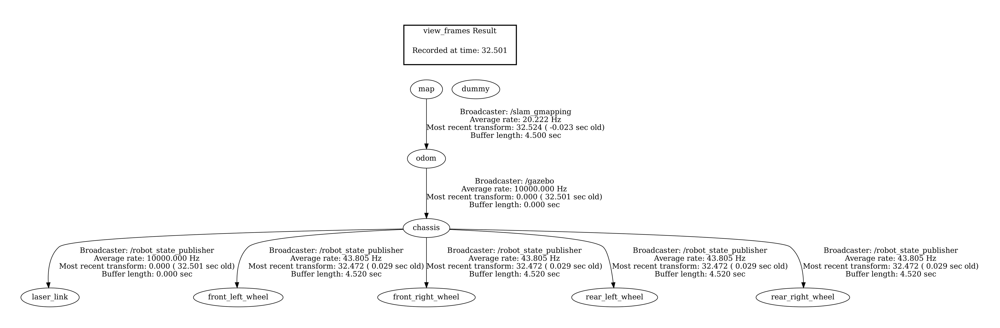
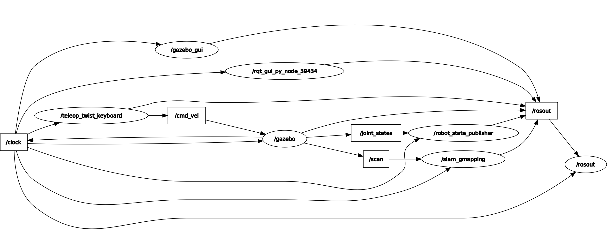
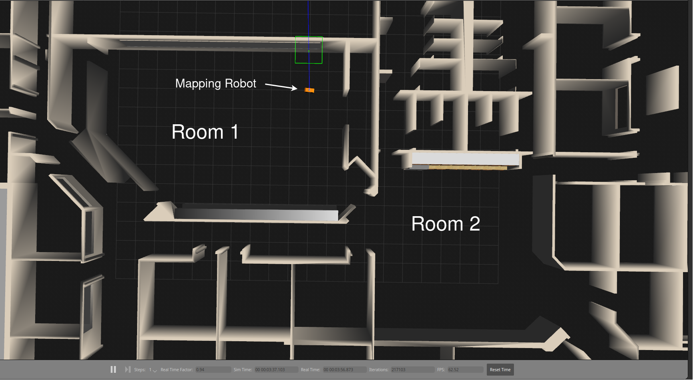
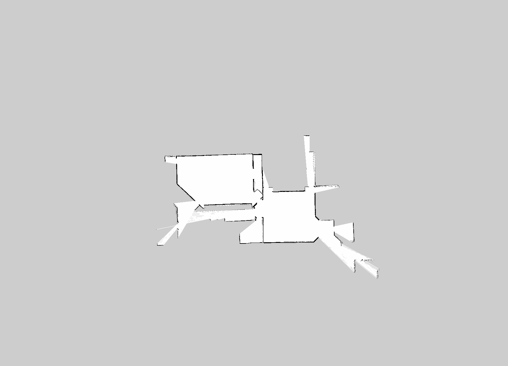

# Teleop robot for mapping

## Description:
A simple teleoperational robot that uses the ROS gmapping package to map its surroundings. It has provisions for both differential drive as well as skid steer for more granular control. Although, using skid steer is preferred on this robot. THe `joint_state_publisher` plugin is used to publish the state of nodes while `robot_state_publisher` node publishes the transform of each.

**TF Frames diagram**

**RQT Graph**

---
## Code explanation:
1. Differential drive plugin:
- `<publishTf>`: toggle the publishing of transforms.
- `<commandTopic>`: topic which issues command.
- `<odometryTopic>`: topic where odometry data should be published.
- `<odometryFrame>`: name of your odometry frame.
- `<publishOdomTf>`: publishes transform from odom to base_link on `/tf`.
- `<publishWheelTf>`: publishes transform from driver wheels (here rear wheels) to base_link (dummy link if it is also used) on `/tf`.
- `<publishWheelJointState>`: publishes joint state of driver wheels (here rear wheels) to the `/joint_states` topic.
- `<legacyMode>`: if true, it swaps position of left and right wheels.

2. Skid steer plugin: 
- `<broadcastTF>`: publishes odom to base_link transform on `/tf`.

3. Joint state publisher plugin: 
- `<jointName>`: publishes the state of joints mentioned here. If no name is mentioned, state of all non-fixed joints is published. Only non-fixed joints allowed.

4. Laser scanner plugin:
- `<min/max angle>`: min max angle of measurement in radians.
- `<visualize>`: visualize the laser rays to show the scanning zone.
- `<samples>` : rays generated in the given angular range. 
- `<range>, <min>, <max>, <resolution>` : min and max distance of scan along with linear resolution of ray.
---

## Miscellaneous:
1. Since our base link is named chassis, use `rosrun gmapping slam_gmapping _base_frame:=chassis`.
2. `rosrun map_server map_saver -f <name_of_map>` to save the map. 
3. `rosbag play --clock <filename>` to play bag file recorded. 
---

---
